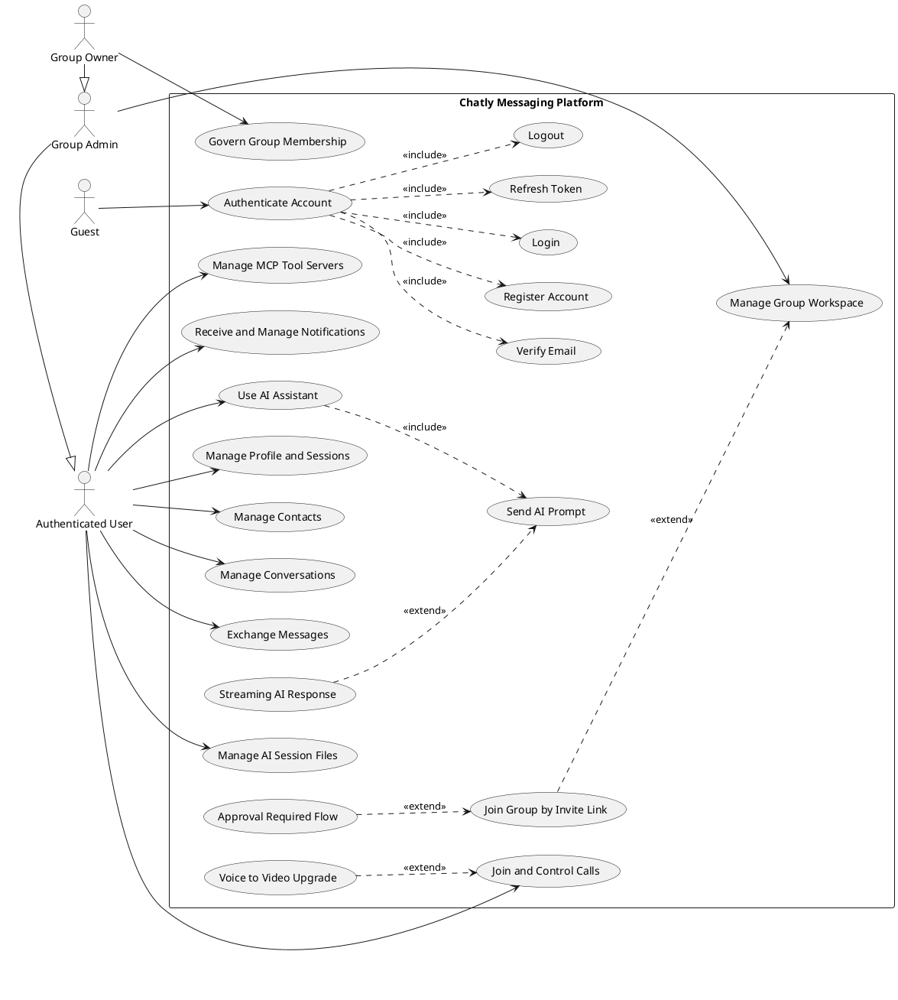

# Chatly UML Input (Use Case + Class Diagram + Entity Diagram + Deployment Diagram)

## 1. Scope and Boundary
This document provides source content to draw four UML artifacts for the current repository state:
1. General Use Case Diagram
2. Application Class Diagram
3. Entity Class Diagram
4. Deployment Diagram

System boundary: Chatly Messaging Platform monorepo
- chatly-backend: Spring Boot REST API + STOMP/WebSocket + auth + persistence
- chatly-agent: FastAPI AI service with LangGraph, RAG, MCP tools
- chatly-frontend: React web client
- chatly-mobile: Expo React Native client

## 2. General Use Case Diagram Content

### 2.1 Actors
Primary actors:
- Guest
- Authenticated User
- Group Owner
- Group Admin

Supporting and external actors:
- Backend API (for Web and Mobile clients)
- AI Agent Service (chatly-agent)
- Email Provider (verification and password reset)
- Push Notification Gateway (Expo push)
- Object Storage (S3/MinIO compatible)
- MCP Servers (custom user servers + system default server)
- Web Search Provider (Tavily)

Actor specialization:
- Group Admin extends Authenticated User
- Group Owner extends Group Admin

### 2.2 Overall Use Cases for One Diagram (recommended)

Use this set when drawing a single general Use Case diagram (similar density to your sample):

Guest:
- Authenticate Account

Authenticated User:
- Manage Profile and Sessions
- Manage Contacts
- Manage Conversations
- Exchange Messages
- Join and Control Calls
- Receive and Manage Notifications
- Use AI Assistant
- Manage AI Session Files
- Manage MCP Tool Servers

Group Admin:
- Manage Group Workspace

Group Owner:
- Govern Group Membership

### 2.3 Include and Extend Notes (diagram arrows)

Use <<include>> relationships:
- Authenticate Account <<include>> Register Account
- Authenticate Account <<include>> Login
- Authenticate Account <<include>> Refresh Token
- Authenticate Account <<include>> Logout
- Authenticate Account <<include>> Verify Email

- Manage Profile and Sessions <<include>> View or Update Profile
- Manage Profile and Sessions <<include>> Change Password
- Manage Profile and Sessions <<include>> Manage Login Sessions
- Manage Profile and Sessions <<include>> Manage Device Token

- Manage Contacts <<include>> Send or Accept Friend Request
- Manage Contacts <<include>> Block or Unblock User
- Manage Contacts <<include>> Check Block Status

- Manage Conversations <<include>> Create or Delete Conversation
- Manage Conversations <<include>> List or Search Conversations
- Manage Conversations <<include>> Pin or Mute Conversation

- Exchange Messages <<include>> Send Message
- Exchange Messages <<include>> Forward or Reply Message
- Exchange Messages <<include>> React, Edit, Recall, Delete Message
- Exchange Messages <<include>> Search and Pin Messages
- Exchange Messages <<include>> Poll and Priority Actions

- Manage Group Workspace <<include>> Update Group Information
- Manage Group Workspace <<include>> Manage Group Notes
- Manage Group Workspace <<include>> Manage Group Reminders
- Govern Group Membership <<include>> Add or Remove Member
- Govern Group Membership <<include>> Update Member Role
- Govern Group Membership <<include>> Review Pending Join Requests

- Use AI Assistant <<include>> Manage AI Session
- Use AI Assistant <<include>> Send AI Prompt
- Use AI Assistant <<include>> Fetch AI Message History
- Manage AI Session Files <<include>> Upload AI File
- Manage AI Session Files <<include>> List or Delete AI File
- Manage MCP Tool Servers <<include>> Register MCP Server
- Manage MCP Tool Servers <<include>> Activate or Deactivate MCP Server
- Manage MCP Tool Servers <<include>> List MCP Tools

Use <<extend>> relationships:
- Join Group by Invite Link <<extend>> Manage Group Workspace
- Approval Required Flow <<extend>> Join Group by Invite Link
- Voice to Video Upgrade <<extend>> Join and Control Calls
- Streaming AI Response <<extend>> Send AI Prompt

### 2.4 Actor Generalization (for diagram inheritance arrows)
- Group Admin --|> Authenticated User
- Group Owner --|> Group Admin

### 2.5 PlantUML Starter (overall use case)

### 2.6 Optional Detailed Use Case List (for appendix, not main diagram)

Guest detailed actions:
- Register account
- Login
- Resend verification email
- Verify email by token link
- Request forgot password
- Introspect token validity

Authenticated User detailed actions:
- Logout
- Refresh access token
- Change password
- Manage active login sessions (list, revoke, purge)
- View and update profile
- Add and remove device token for push
- Search users

Contact and social detailed actions:
- Send friend request
- Accept friend request
- Block contact by contact record
- Unblock contact by contact record
- Block user by user ID
- Unblock user by user ID
- View all contacts
- View contacts by status
- View block status with another user
- Delete contact

Conversation and messaging detailed actions:
- Create conversation (private or group)
- View conversation by ID
- List my conversations
- Search conversations
- Delete conversation
- Pin and unpin conversation
- Mute and unmute conversation
- Send message
- Forward message
- Load conversation messages with paging
- Mark message as seen
- Recall message
- Edit message
- Delete message
- React to message
- Search messages in conversation
- Vote in poll message
- Close poll message
- Pin and unpin message
- List pinned messages
- Tag priority

Group detailed actions:
- Add member to group
- Remove member from group
- Update member role
- Update group info
- List group members
- Create or get invite link
- Reset invite link
- Join group by invite link
- List pending join requests
- Approve pending join request
- Reject pending join request
- List reminders
- Create reminder
- Toggle reminder complete
- Update reminder
- Delete reminder
- List notes
- Create note
- Update note
- Delete note

Call and realtime detailed actions:
- View call history
- View call details
- Send chat message by STOMP
- Broadcast typing status
- Mark seen by STOMP
- Initiate one-to-one call
- Answer one-to-one call
- Send ICE candidate
- End one-to-one call
- Request voice to video upgrade
- Accept or reject video upgrade
- Renegotiate call media
- Initiate group call
- Join group call
- Exchange group call signaling
- Leave group call

AI detailed actions:
- Create AI session
- List AI sessions
- Get AI session details
- Rename AI session
- Delete AI session
- Get AI session message history
- Send AI chat request (blocking)
- Send AI chat request (streaming)
- Upload AI session file
- List AI session files
- Delete AI session file
- Download AI session file content
- Register MCP server for AI tools
- List MCP servers
- Get MCP server details
- Delete MCP server
- Toggle MCP server active flag
- List tools for a specific MCP server

## 3. Application Class Diagram Content

## 3.1 Backend (chatly-backend)

### Controllers and dependencies
- AuthController -> AuthService
- AuthSessionController -> UserSessionService
- UserController -> UserService
- UserSettingsController -> UserSettingsService
- ContactController -> ContactService
- ConversationController -> ConversationService
- MessageController -> MessageService
- GroupController -> GroupService
- NotificationController -> NotificationService
- FileUploadController -> FileUploadService
- CallHistoryController -> CallSessionRepository
- AgentSessionController -> AgentProxyClient
- AgentChatController -> AgentProxyClient
- AgentFileController -> AgentProxyClient
- AgentMcpController -> AgentProxyClient
- HealthController (no service layer in current code)

### Services and dependencies
- AuthService -> UserRepository, EmailVerificationOtpRepository, JwtProvider, TokenBlacklistService, UserSessionService, EmailVerificationMailService
- UserService -> UserRepository, ContactRepository, UserMapper
- ContactService -> ContactRepository, UserRepository, ContactMapper, NotificationService
- ConversationService -> ConversationRepository, GroupMemberRepository, UserRepository, ConversationMapper
- MessageService -> MessageRepository, ConversationRepository, MessageMapper, NotificationService
- GroupService -> ConversationRepository, GroupMemberRepository, UserRepository, PendingJoinRequestRepository, GroupReminderRepository, GroupNoteRepository, NotificationService
- NotificationService -> NotificationRepository, UserRepository, ExpoPushService, AsyncNotificationService, SimpMessagingTemplate
- UserSettingsService -> UserSettingsRepository
- FileUploadService -> FileMetadataRepository and storage provider
- PresenceService -> UserRepository and SimpMessagingTemplate
- UserSessionService -> UserLoginSessionRepository, UserRepository, GeoIpLookupService
- TokenBlacklistService -> Redis cache

### WebSocket classes and dependencies
- ChatMessageController -> MessageService, SimpMessagingTemplate
- CallWebSocketController -> CallSessionRepository, ConversationRepository, MessageService, SimpMessagingTemplate
- PresenceEventListener -> CallSessionRepository, ConversationRepository, PresenceService, MessageService, SimpMessagingTemplate
- WebSocketConfig -> broker endpoints and channel setup
- WebSocketAuthInterceptor -> JwtProvider
- JwtHandshakeHandler -> principal resolution for websocket user

### Security and integration classes
- WebSecurityConfig -> JwtAuthenticationFilter, security rules
- JwtAuthenticationFilter -> JwtProvider
- PasswordChangeTokenValidator -> UserRepository
- SessionTokenValidator -> UserLoginSessionRepository
- AgentProxyClient -> WebClient and remote chatly-agent APIs

## 3.2 Agent (chatly-agent)

### Router layer
- sessions router -> SessionService, FileService
- chat router -> ChatService
- files router -> FileService
- mcp router -> MCPService, SystemMCPService
- health router -> MongoDB readiness check

### Service layer
- ChatService -> SessionService, MessageRepository, ToolService, VectorService, FileRepository, ChatbotAgent, UnifiedAgent
- SessionService -> SessionRepository, MessageRepository
- FileService -> SessionService, FileRepository, ChunkRepository, VectorService, MinIO client, embedder
- VectorService -> ChunkRepository, QdrantRepository, embedder
- MCPService -> MCPRepository, MCPClient
- SystemMCPService -> MCPClient (system default server config)
- ToolService -> MCPService, SystemMCPService, web search tool factory, mcp tool factory

### Agent classes
- ChatbotAgent
- UnifiedAgent

### Repository and infrastructure classes
- SessionRepository (collection: sessions)
- MessageRepository (collection: messages)
- FileRepository (collection: files)
- ChunkRepository (collection: chunks)
- MCPRepository (collection: mcp_servers)
- QdrantRepository (collection: vectors in qdrant_collection_name)
- app.db.mongo singleton client
- app.db.qdrant singleton client
- app.storage.minio singleton client

## 3.3 Frontend (chatly-frontend)

### Core service classes
- auth.service
- user.service
- contact.service
- conversation.service
- message.service
- group.service
- notification.service
- file.service
- call.service
- socket.service
- agent.service
- agent-file.service
- mcp.service
- session.service

### Core hook and context classes
- CallSocketProvider (CallContext) -> useCallSocket, useGroupCallSocket
- useChatSocket
- usePresenceSocket
- useNotificationSocket
- useCallSocket
- useGroupCallSocket
- useWebRTC
- useGroupWebRTC
- useAudioRecorder
- useAgentStream

### Store classes
- auth.store
- chatbot.store
- call.store
- contact.store
- conversationPrefs.store
- notification.store
- theme.store
- ui.store

## 3.4 Mobile (chatly-mobile)

### Core service classes
- auth.service
- user.service
- contact.service
- conversation.service
- message.service
- group.service
- notification.service
- file.service
- call.service
- socket.service
- agent.service
- agent-file.service
- mcp.service
- session.service

### Core hook and context classes
- CallSocketProvider (CallContext) -> useCallSocket, useGroupCallSocket
- useChatSocket
- usePresenceSocket
- useNotificationSocket
- useCallSocket
- useGroupCallSocket
- useWebRTC
- useGroupWebRTC
- useVoiceRecorder
- useExpoPush
- useAgentStream

### Store classes
- auth.store
- chatbot.store
- call.store
- contact.store
- conversation.store
- conversationPrefs.store
- message.store
- notification.store

## 3.5 Cross-module relationships (draw as dependencies)
- Frontend -> Backend: REST + STOMP/WebSocket
- Mobile -> Backend: REST + STOMP/WebSocket
- Backend -> Agent: internal REST through AgentProxyClient
- Agent -> Backend system MCP: MCP over SSE transport (when configured)
- Backend -> PostgreSQL: user and contact relational data
- Backend -> MongoDB: messaging and realtime domain documents
- Backend -> Redis: token blacklist cache
- Agent -> MongoDB: AI sessions and messages
- Agent -> Qdrant: vector index and retrieval
- Backend and Agent -> MinIO or S3: binary file storage

## 4. Entity Class Diagram Content

## 4.1 SQL entities (chatly-backend, PostgreSQL)

### User
Fields:
- id: UUID (PK)
- username: String (unique, required)
- email: String (unique, optional)
- emailVerified: boolean
- password: String
- displayName: String
- avatarUrl: String
- phone: String (unique, optional)
- dob: Instant
- bio: String
- status: UserStatus
- lastSeen: Instant
- deviceTokens: Set<String>
- passwordChangedAt: Instant
- createdAt: Instant
- updatedAt: Instant

### Contact
Fields:
- id: UUID (PK)
- user: User (many-to-one)
- contact: User (many-to-one)
- status: ContactStatus
- blockedBy: UUID
- createdAt: Instant
Constraint:
- unique(user_id, contact_id)

### GroupMember
Fields:
- id: UUID (PK)
- conversationId: String
- user: User (many-to-one)
- role: GroupRole
- nickname: String
- joinedAt: Instant
Constraint:
- unique(conversation_id, user_id)

### UserLoginSession
Fields:
- id: UUID (PK)
- userId: UUID
- platform: ClientPlatform
- revoked: boolean
- revokedAt: Instant
- deviceLabel: String
- userAgent: String
- ipAddress: String
- locationLabel: String
- geoSnapshot: JsonNode
- createdAt: Instant
- lastSeenAt: Instant

### EmailVerificationOtp
Fields:
- id: UUID (PK)
- userId: UUID
- verificationToken: String
- expiresAt: Instant
- used: boolean
- createdAt: Instant

## 4.2 MongoDB entities (chatly-backend)

### Conversation (collection: conversations)
Fields:
- id: String
- type: ConversationType
- name: String
- avatarUrl: String
- creatorId: String
- participantIds: List<String>
- lastMessage: LastMessage
- allowMembersUpdateInfo: Boolean
- requireApproval: Boolean
- inviteToken: String
- pinnedBy: Set<String>
- mutedBy: Map<String, Instant>
- createdAt: Instant
- updatedAt: Instant

### Message (collection: messages)
Fields:
- id: String
- conversationId: String
- senderId: String
- content: String
- type: MessageType
- status: MessageStatus
- replyToId: String
- forwardedFromId: String
- forwardedFromConversationId: String
- attachments: List<Attachment>
- readBy: List<ReadReceipt>
- recalled: boolean
- recalledAt: Instant
- recalledBy: String
- edited: boolean
- editedAt: Instant
- editHistory: List<EditHistory>
- reactions: List<Reaction>
- poll: Poll
- location: LocationPayload
- pinned: boolean
- pinnedAt: Instant
- pinnedBy: String
- priority: String
- mentions: List<String>
- createdAt: Instant
- updatedAt: Instant

### Notification (collection: notifications)
Fields:
- id: String
- type: NotificationType
- senderId: String
- receiverId: String
- referenceId: String
- content: String
- read: boolean
- createdAt: Instant

### UserSettings (collection: user_settings)
Fields:
- id: String
- userId: String (unique)
- privacy: PrivacySettings
- notifications: NotificationSettings
- messages: MessageSettings
- createdAt: Instant
- updatedAt: Instant

### CallSession (collection: call_sessions)
Fields:
- id: String
- callId: String (unique)
- conversationId: String
- initiatorId: String
- participants: List<String>
- type: CallType
- status: CallStatus
- startedAt: LocalDateTime
- endedAt: LocalDateTime

### FileMetadata (collection: file_metadata)
Fields:
- id: String
- provider: String
- storageKey: String
- url: String
- fileName: String
- fileType: String
- fileSize: Long
- uploadedBy: String
- conversationId: String
- createdAt: Instant

### GroupNote (collection: group_notes)
Fields:
- id: String
- conversationId: String
- creatorId: String
- title: String
- content: String
- pinned: Boolean
- createdAt: Instant
- updatedAt: Instant

### GroupReminder (collection: group_reminders)
Fields:
- id: String
- conversationId: String
- creatorId: String
- title: String
- description: String
- remindAt: Instant
- completed: Boolean
- notified: Boolean
- createdAt: Instant

### PendingJoinRequest (collection: pending_join_requests)
Fields:
- id: String
- conversationId: String
- userId: String
- invitedBy: String
- createdAt: Instant
Constraint:
- unique(conversationId, userId)

## 4.3 Embedded value objects (chatly-backend)
- LastMessage(senderId, content, type, timestamp)
- Attachment(fileId, name, url, type, size, durationSeconds)
- ReadReceipt(userId, readAt)
- Reaction(userId, emoji, createdAt)
- EditHistory(content, editedAt)
- Poll(question, options, multipleChoice, votes, closed, deadline, anonymous)
- LocationPayload(latitude, longitude, address, mapSnapshotUrl)
- PrivacySettings(showOnlineStatus, showLastSeen, showReadReceipts, allowFriendRequests)
- NotificationSettings(messageSound, groupSound, callSound, showPreview)
- MessageSettings(enterToSend, autoDownloadMedia, fontSize)

## 4.4 Agent-side persistence entities (chatly-agent)

Mongo collections through repositories:
- sessions
  - _id, user_id, title, created_at, updated_at
- messages
  - _id, session_id, role, content, attachments, created_at
- files
  - _id, session_id, user_id, filename, mime_type, size_bytes, minio_bucket, object_key, etag, created_at
- chunks
  - _id, file_id, session_id, user_id, content, chunk_index
- mcp_servers
  - _id, user_id, name, url, headers, transport, is_active, created_at, updated_at

Qdrant payload for indexed chunks:
- session_id
- file_id
- user_id
- content
- chunk_index
- filename

## 4.5 Relationship definitions for entity diagram arrows

SQL relationships:
- User 1 -> 0..* Contact (as requester)
- User 1 -> 0..* Contact (as target)
- User 1 -> 0..* GroupMember
- User 1 -> 0..* UserLoginSession
- User 1 -> 0..* EmailVerificationOtp

Mongo relationships (by ID references):
- Conversation 1 -> 0..* Message (Message.conversationId)
- Conversation 1 -> 0..* GroupNote (GroupNote.conversationId)
- Conversation 1 -> 0..* GroupReminder (GroupReminder.conversationId)
- Conversation 1 -> 0..* PendingJoinRequest (PendingJoinRequest.conversationId)
- Conversation 1 -> 0..* CallSession (CallSession.conversationId)
- Conversation 1 -> 0..* FileMetadata (FileMetadata.conversationId)
- Message 1 -> 0..* Message (self-reference via replyToId)
- UserSettings 1 -> 1 User (by userId)

Cross-store relationship:
- GroupMember.conversationId references Conversation.id
- GroupMember.user references User.id

Agent relationships:
- Session 1 -> 0..* Agent Message
- Session 1 -> 0..* Agent File
- Agent File 1 -> 0..* Chunk
- MCP Server 1 -> 0..* Tool definitions discovered at runtime

## 5. Notes for the diagram author
- Keep backend as the core bounded context.
- Show AI module as a separate bounded context connected by AgentProxyClient.
- Show Web and Mobile as separate clients with similar service and websocket stacks.
- For entity diagram, represent most Mongo relations as logical references, not physical FK constraints.
- Optional: split entity diagram into three sub-diagrams for readability.
  - SQL entities
  - Backend Mongo entities
  - Agent persistence entities

## 6. Deployment Diagram Content

### 6.1 Deployment nodes and artifacts

Client zone:
- Node: End User Device
- Artifact: Web SPA bundle (chatly-frontend static assets)
- Artifact: Mobile app binary (chatly-mobile)

Edge zone:
- Node: Reverse Proxy or API Gateway (recommended in production)
- Responsibility: TLS termination, route /api and /ws traffic to backend, serve static frontend assets

Application zone:
- Node: chatly-backend (Spring Boot)
- Artifact: chatly-backend executable jar
- Exposed interfaces:
  - HTTP REST API on default port 8080
  - STOMP and SockJS endpoint /ws
  - Raw WebSocket endpoint /ws-raw
  - Internal MCP SSE endpoint /api/ai/mcp/sse

- Node: chatly-agent (FastAPI)
- Artifact: agent-server container image
- Exposed interfaces:
  - Internal HTTP API on default port 8000

Data and storage zone:
- Node: PostgreSQL (relational data for auth and contacts)
- Node: MongoDB (backend domain documents)
- Node: Redis (token blacklist and fast cache)
- Node: MongoDB (agent collections)
- Node: Qdrant (vector index)
- Node: Object Storage (MinIO in local, S3 in production)

External integration zone:
- Node: SMTP provider (email verification and password flows)
- Node: Expo Push service (mobile notifications)
- Node: Groq API (LLM inference)
- Node: Tavily API (web search tool)
- Node: User-owned MCP servers (optional)

### 6.2 Runtime communication links and protocols
- Web app -> chatly-backend: HTTPS REST (JSON)
- Mobile app -> chatly-backend: HTTPS REST (JSON)
- Web app -> chatly-backend: WSS STOMP over /ws
- Mobile app -> chatly-backend: WSS over /ws-raw
- chatly-backend -> PostgreSQL: JDBC over TCP 5432
- chatly-backend -> MongoDB: Mongo wire protocol over TCP 27017
- chatly-backend -> Redis: RESP over TCP 6379
- chatly-backend -> chatly-agent: internal HTTP with X-Internal-API-Key
- chatly-agent -> agent MongoDB: Mongo wire protocol over TCP 27017 (host mapping commonly 27018)
- chatly-agent -> Qdrant: HTTP API over TCP 6333
- chatly-agent -> Object Storage: S3-compatible API or AWS S3 API
- chatly-agent -> Groq and Tavily: outbound HTTPS
- chatly-agent -> backend MCP SSE: outbound HTTP SSE to /api/ai/mcp/sse with X-Internal-API-Key and X-User-Id
- chatly-backend -> SMTP provider: SMTP with STARTTLS
- chatly-backend -> Expo Push service: outbound HTTPS

### 6.3 Local development deployment view
- Backend infrastructure compose (chatly-backend/docker-compose.yml):
  - postgres on 5432
  - mongodb on 27017
  - redis on 6379
- Agent infrastructure compose (chatly-agent/docker-compose.yml):
  - agent mongodb exposed on host 27018
  - qdrant on 6333 and 6334
  - agent app on 8000
- Frontend and mobile are usually run in developer mode and connect to backend endpoints via env settings.

### 6.4 Production deployment view
- Deploy web static assets behind CDN or reverse proxy.
- Deploy backend and agent as separate stateless containers or pods.
- Keep PostgreSQL, MongoDB, Redis, Qdrant, and object storage in managed services or dedicated stateful nodes.
- Store all secrets in environment or secret manager, never in source.
- Use private network routing for backend -> agent and service -> database traffic.

### 6.5 Availability and scaling constraints
- chatly-backend WebSocket currently uses Spring SimpleBroker (in-memory), so multi-instance realtime at scale needs either sticky sessions or external broker-backed design.
- chatly-backend and chatly-agent are stateless at application level and can scale horizontally when datastore and network constraints are handled.
- Qdrant and MongoDB should have persistence and backup policies defined before production rollout.

### 6.6 Suggested deployment diagram partitions
- Partition 1: Client devices and edge
- Partition 2: Application services (backend and agent)
- Partition 3: Datastores and object storage
- Partition 4: External providers and integrations
