# Architecture — agent-server

---

## Table of Contents

1. [System Overview](#1-system-overview)
2. [Component Architecture](#2-component-architecture)
3. [Request Lifecycle](#3-request-lifecycle)
4. [Agent Routing Logic](#4-agent-routing-logic)
5. [File Upload & RAG Pipeline](#5-file-upload--rag-pipeline)
6. [MCP Tool Integration](#6-mcp-tool-integration)
7. [LangGraph State Machines](#7-langgraph-state-machines)
8. [Database Design](#8-database-design)
9. [Security Model](#9-security-model)
10. [Infrastructure](#10-infrastructure)
11. [Layer Responsibilities](#11-layer-responsibilities)

---

## 1. System Overview

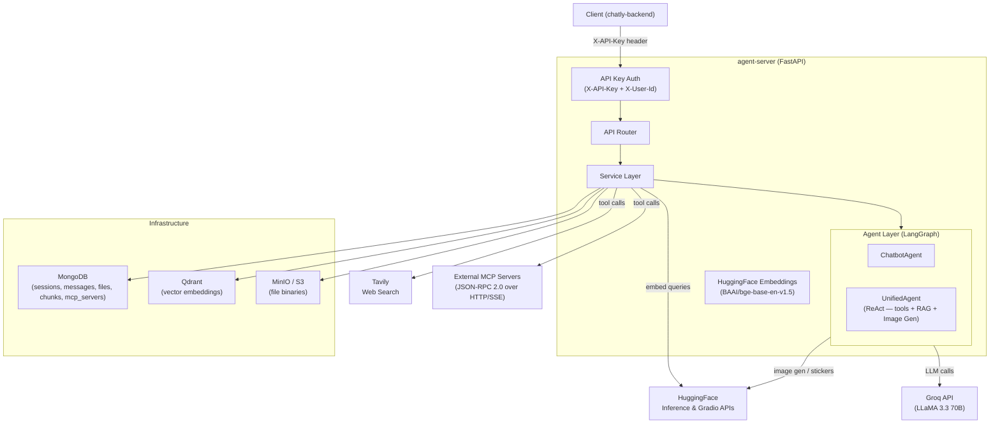

---

## 2. Component Architecture

```mermaid
graph LR
    subgraph Routers ["Routers (HTTP only)"]
        R_Sessions["sessions.py"]
        R_Chat["chat.py"]
        R_Files["files.py"]
        R_MCP["mcp.py"]
        R_Health["health.py"]
    end

    subgraph Services ["Services (Business Logic)"]
        SessionSvc["SessionService"]
        ChatSvc["ChatService"]
        FileSvc["FileService"]
        VectorSvc["VectorService"]
        MCPSvc["MCPService"]
        ToolSvc["ToolService"]
        SystemMCPSvc["SystemMCPService"]
    end

    subgraph AgentLayer ["Agents + Graphs"]
        ChatbotAgent["ChatbotAgent"]
        UnifiedAgent["UnifiedAgent\n(create_react_agent)"]
        ChatbotGraph["chatbot_graph\nSTART → llm_node → END"]
        RetrieverTool["retriever_tool\nsearch_documents()"]
        MCPTool["mcp_tool"]
        WebSearchTool["web_search_tool"]
        ImageGenTool["image_gen_tool\ngenerate_image()\ngenerate_sticker()"]
    end

    subgraph Repos ["Repositories (Data Access)"]
        SessionRepo["SessionRepository"]
        MessageRepo["MessageRepository"]
        FileRepo["FileRepository"]
        ChunkRepo["ChunkRepository"]
        MCPRepo["MCPRepository"]
        QdrantRepo["QdrantRepository"]
    end

    subgraph DBClients ["DB Clients (Singletons)"]
        MongoClient["Motor AsyncIOMotorClient\napp/db/mongo.py"]
        QdrantClient["AsyncQdrantClient\napp/db/qdrant.py"]
        StorageClient["Minio Client\napp/storage/minio.py"]
    end

    Routers --> Services
    Services --> AgentLayer
    Services --> Repos
    AgentLayer --> ChatbotAgent & UnifiedAgent
    ChatbotAgent --> ChatbotGraph
    UnifiedAgent --> RetrieverTool & MCPTool & WebSearchTool & ImageGenTool
    Repos --> DBClients
```

---

## 3. Request Lifecycle

### Blocking Chat Request

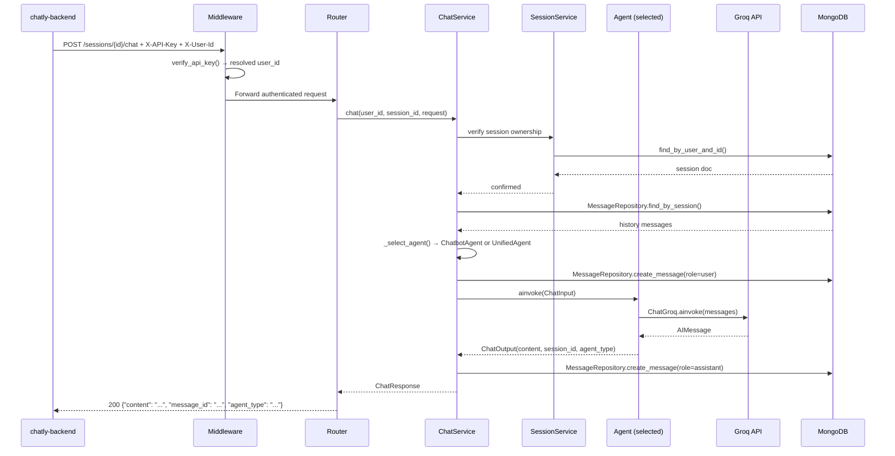

### SSE Streaming Request

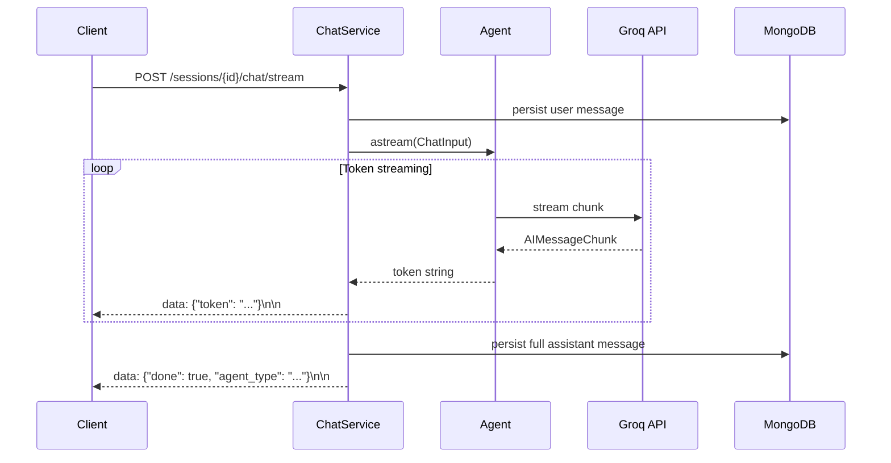

---

## 4. Agent Routing Logic

`ChatService._select_agent()` automatically picks the right agent based on request context:

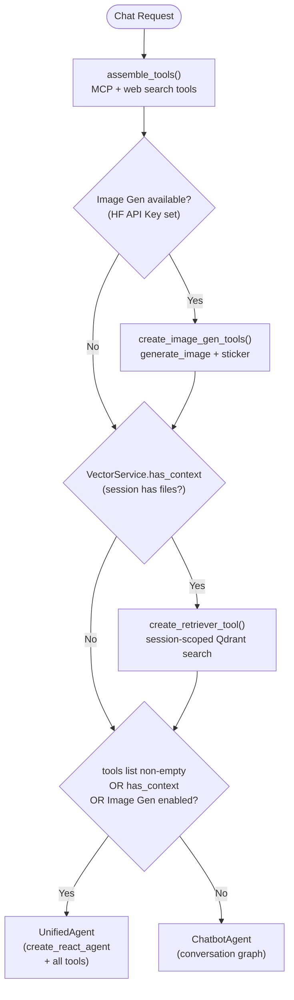

Priority: **UnifiedAgent (tools + RAG + Image Gen combined) > ChatbotAgent**

The `UnifiedAgent` can handle tools, context, and image generation simultaneously — everything is exposed as LangChain tools in a single ReAct loop.

---

## 5. File Upload & RAG Pipeline

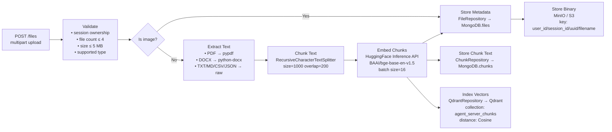

---

## 6. MCP Tool Integration

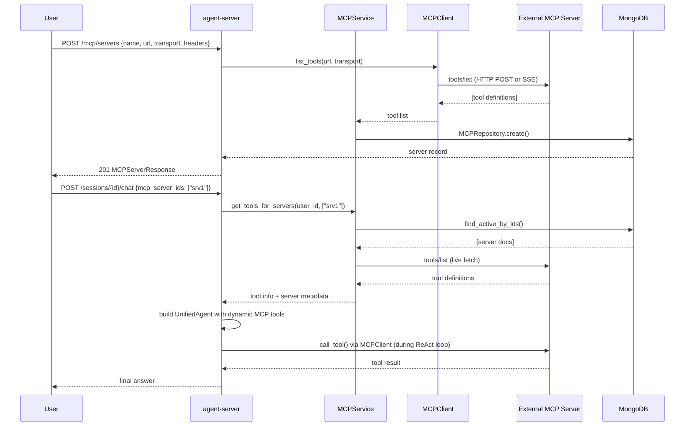

---

## 7. LangGraph State Machines

### Chatbot Graph

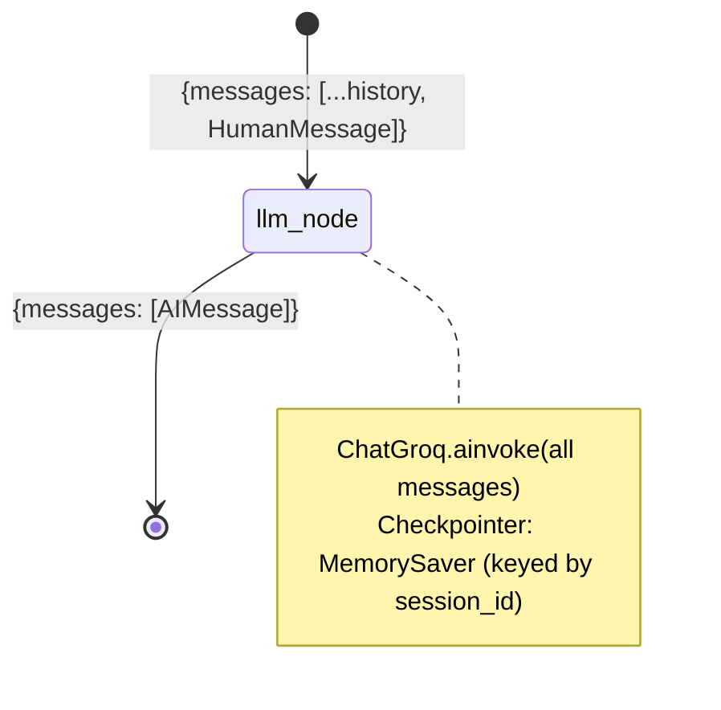

Used by `ChatbotAgent` — pure conversation with no external tools.

### UnifiedAgent (create_react_agent)

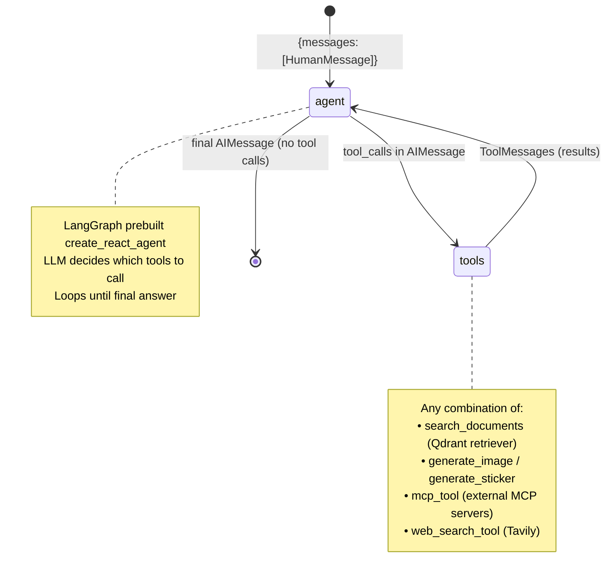

Each `UnifiedAgent` instance is built fresh per request by `_select_agent()` and receives only the tools relevant to that request.

---

## 8. Database Design

### MongoDB Collections

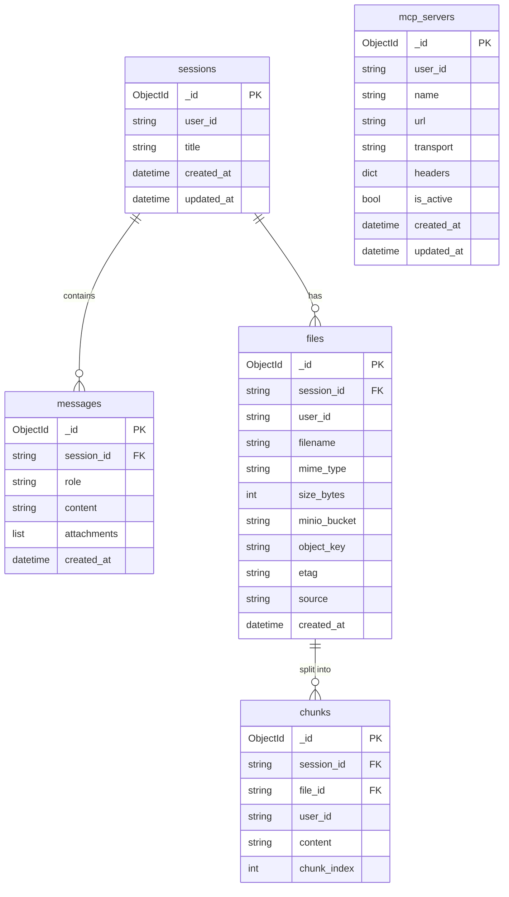

### Qdrant Collection (`agent_server_chunks`)

| Field | Type | Description |
|---|---|---|
| vector | float\[768\] | BAAI/bge-base-en-v1.5 embedding, Cosine distance |
| `session_id` | string (payload) | Used for filtered search |
| `file_id` | string (payload) | Used for deletion by file |
| `user_id` | string (payload) | Owner reference |
| `content` | string (payload) | Raw chunk text returned to LLM |
| `chunk_index` | int (payload) | Position within original file |
| `filename` | string (payload) | Source filename for citations |

### Object Storage Bucket (`uploads`)

Object key pattern: `{user_id}/{session_id}/{uuid4 or 'generated'}/{filename}`

---

## 9. Security Model

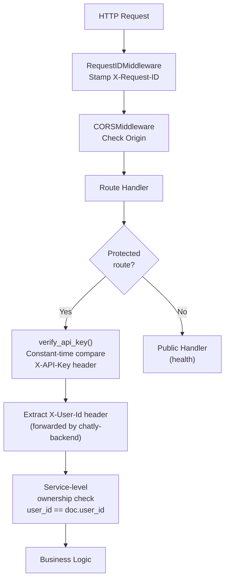

---

## 10. Infrastructure

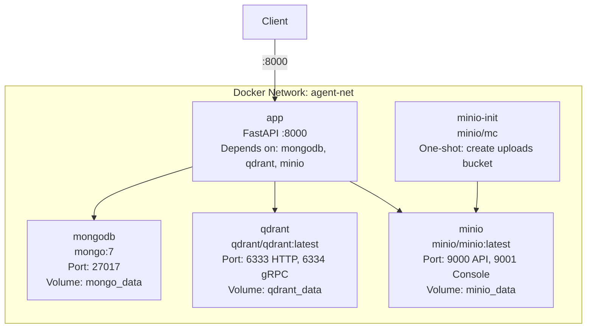

---

## 11. Layer Responsibilities

| Layer | Location | Responsibility | Forbidden |
|---|---|---|---|
| **Routers** | `app/routers/` | HTTP request/response, status codes, DI injection | Business logic, DB calls |
| **Services** | `app/services/` | Business logic, orchestration, ownership checks | Direct DB/Motor calls |
| **Repositories** | `app/repositories/` | All MongoDB and Qdrant I/O | Business logic |
| **Agents** | `app/agents/` | LangGraph invocation, token streaming | Direct DB calls |
| **Graphs** | `app/graphs/` | LangGraph state machine definitions | Side effects outside state |
| **DB clients** | `app/db/` | Motor and Qdrant singleton clients | Business logic |
| **Storage** | `app/storage/` | MinIO / S3 singleton client | Business logic |
| **Models** | `app/models/` | Pydantic schemas for API I/O | Logic |
| **Utils** | `app/utils/` | LLM factory, embedder factory | Stateful operations |
| **Tools** | `app/tools/` | External tool implementations (Retriever, MCP, Web, Image Gen) | Business logic |
