# Architecture — Chatly Agent

---

## Table of Contents

1. [System Overview](#1-system-overview)
2. [Component Architecture](#2-component-architecture)
3. [Request Lifecycles](#3-request-lifecycles)
4. [Agent Routing](#4-agent-routing)
5. [Agents](#5-agents)
6. [RAG and File Indexing](#6-rag-and-file-indexing)
7. [MCP Integration](#7-mcp-integration)
8. [Streaming Events](#8-streaming-events)
9. [Database Design](#9-database-design)
10. [Security Model](#10-security-model)
11. [Infrastructure](#11-infrastructure)
12. [Layer Responsibilities](#12-layer-responsibilities)

---

## 1. System Overview

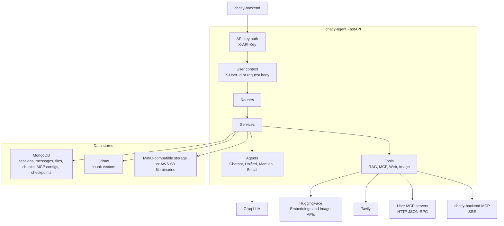

`chatly-agent` is not a public client-facing service. It receives calls from `chatly-backend`, persists AI sessions and messages, invokes LLMs and tools, and returns or publishes AI-generated results.

---

## 2. Component Architecture

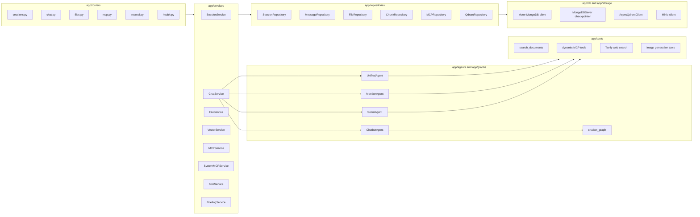

---

## 3. Request Lifecycles

### Blocking Chat

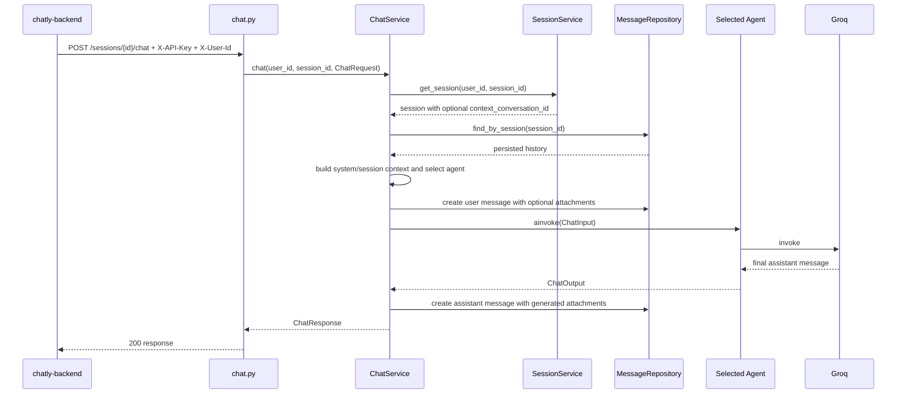

### Streaming Chat

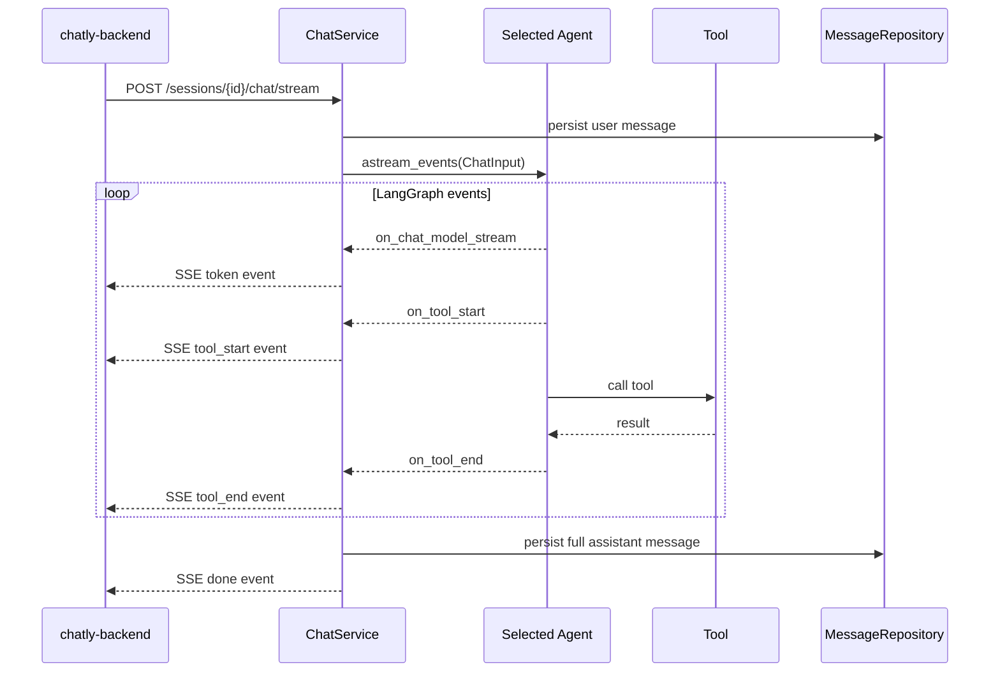

### Internal Background Triggers

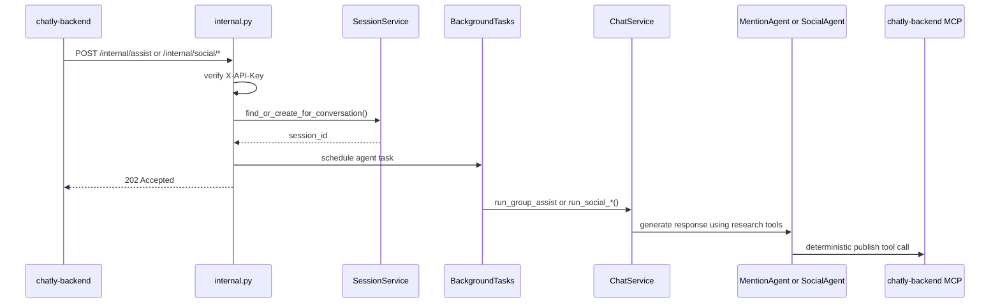

---

## 4. Agent Routing

`ChatService._select_agent()` decides only for interactive `/sessions/{id}/chat` requests.

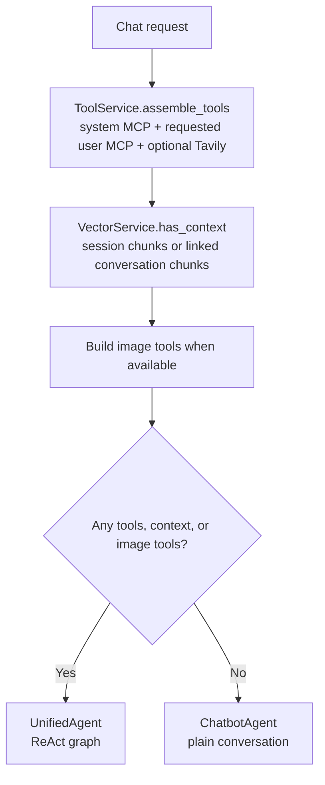

`UnifiedAgent` receives the complete per-request tool list:

- System backend MCP tools when `CHATLY_BACKEND_MCP_URL` is configured.
- User MCP tools requested by `mcp_server_ids`.
- Tavily web search when `use_web_search=true` and configured.
- `search_documents` when session or linked conversation chunks exist.
- Image tools when the image generation integration is available.

---

## 5. Agents

### ChatbotAgent

Plain conversational agent. It prepends `CHATLY_SYSTEM_PROMPT`, injects MongoDB message history, and invokes a simple LangGraph chatbot graph.

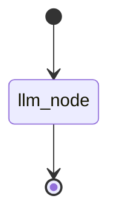

### UnifiedAgent

General ReAct agent for interactive chat with tools and RAG. A fresh graph is created per request so tool availability cannot leak across requests.

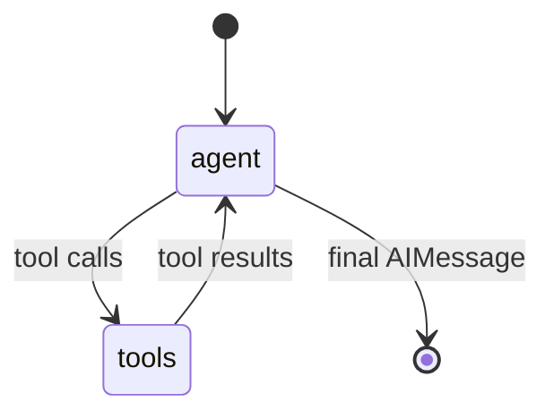

It uses `UNIFIED_AGENT_SYSTEM_PROMPT` formatted with `user_id` and runtime `session_context`. MongoDBSaver checkpointing is enabled outside `APP_ENV=test`.

### MentionAgent

Handles group `@AI` mentions from `/internal/assist`.

- Uses research/context MCP tools in a ReAct loop.
- Removes `sendAiMessage` from the LLM tool loop.
- Calls `sendAiMessage` programmatically after final text generation.
- Excludes `sendTextMessage` to avoid duplicate group posts.

### SocialAgent

Handles `/internal/social/mention-comment` and `/internal/social/post-command`.

- Uses research tools when available.
- Detects the `createAiPostComment` publish tool by schema/description.
- Publishes the final AI reply programmatically.

### BriefingService Flow

`BriefingService` creates a temporary "Daily Briefing" session and streams a prompt through `ChatService`. The agent is expected to call backend MCP tools such as `getMyConversations`, `readRecentMessages`, `listGroupReminders`, and `sendTextMessage`.

---

## 6. RAG and File Indexing

### Session File Upload

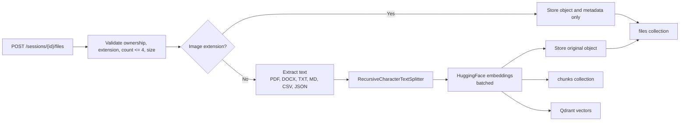

Supported extensions are `txt`, `md`, `pdf`, `docx`, `csv`, `json`, `jpeg`, `jpg`, `png`, and `webp`. Text-like files are embedded. Images are stored as attachments only.

### Conversation File Indexing

`POST /internal/index-file` is used when `chatly-backend` uploads a file to a group conversation. The agent downloads the backend-provided file URL, extracts and embeds text, stores metadata with `conversation_id` and `backend_file_id`, and indexes vectors scoped to that conversation.

When a chat session has `context_conversation_id`, `VectorService.similarity_search()` searches both:

- session-scoped chunks
- conversation-scoped chunks

---

## 7. MCP Integration

### User-Owned MCP Servers

User MCP servers are stored in MongoDB and managed through `/mcp/servers/**`. Registration verifies connectivity by calling `tools/list`.

Default transport is HTTP JSON-RPC 2.0:

```json
{
  "jsonrpc": "2.0",
  "id": 1,
  "method": "tools/list",
  "params": {}
}
```

Tool calls use `tools/call` with `{ "name": "...", "arguments": {...} }`.

### System Backend MCP

`SystemMCPService` configures `chatly-backend` from `CHATLY_BACKEND_MCP_URL`. It is not stored in MongoDB and is not returned by `/mcp/servers`; callers can inspect it through `/mcp/defaults`.

System MCP uses SSE transport and forwards:

```http
X-Internal-API-Key: <INTERNAL_API_KEY>
X-User-Id: <current user id>
```

System MCP also exposes resources. `chatly-agent` reads `chatly://skills/*` resources, concatenates them into runtime skill context, and caches them for 5 minutes.

---

## 8. Streaming Events

`app/models/stream.py` defines the SSE contract:

| Type | Data |
|---|---|
| `token` | `{ "content": string }` |
| `tool_start` | `{ "tool": string, "input": object }` |
| `tool_end` | `{ "tool": string, "output": string }` |
| `error` | `{ "message": string, "code": string?, "category": string?, "retryable": boolean? }` |
| `done` | `{ "agent_type": string, "message_id": string, "attachments": array? }` |

Errors are classified into model rate limit, timeout, provider error, and internal agent error categories before being emitted to clients.

---

## 9. Database Design

### MongoDB Collections

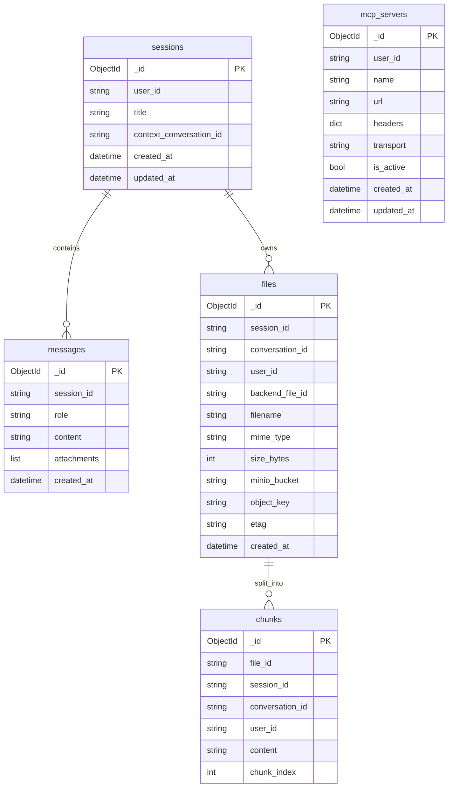

`MongoDBSaver` also stores LangGraph checkpoint documents in the configured MongoDB database.

### Qdrant Collection

Default collection: `agent_server_chunks`.

| Payload | Description |
|---|---|
| `session_id` | Session scope for regular uploads. |
| `conversation_id` | Conversation scope for backend-indexed group files. |
| `file_id` | File metadata ID. |
| `user_id` | Owner or uploader ID. |
| `content` | Raw chunk text. |
| `chunk_index` | Position in source file. |
| `filename` | Source filename. |

Vector size defaults to `768` and should match `HF_EMBEDDING_MODEL`.

### Object Storage

Session uploads use:

```text
{user_id}/{session_id}/{uuid4}/{filename}
```

Conversation-indexed files use:

```text
conversations/{conversation_id}/{uuid4}/{filename}
```

---

## 10. Security Model

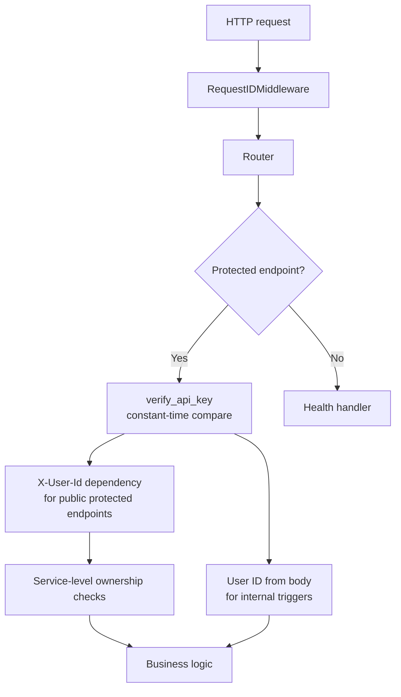

Public protected endpoints use `get_request_context()`, which validates `X-API-Key` and extracts `X-User-Id`. Internal routes use router-level `verify_api_key` and request bodies supplied by `chatly-backend`.

Sensitive values must come from environment variables. Logs must not include JWTs, API keys, message content, emails, or phone numbers.

---

## 11. Infrastructure

Current `docker-compose.yml` defines:

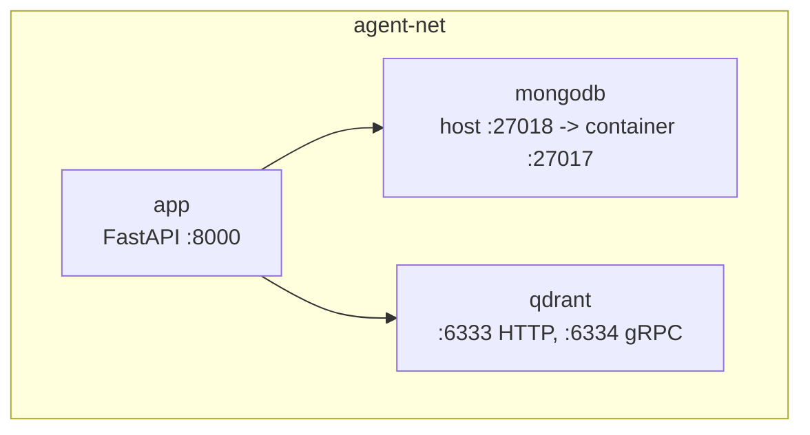

Object storage is external to the current Compose stack:

- `STORAGE_PROVIDER=minio` expects a reachable MinIO endpoint.
- `STORAGE_PROVIDER=s3` expects AWS S3 credentials and a pre-created bucket.

During application startup, the lifespan hook pings MongoDB, checks Qdrant, ensures the object storage bucket for MinIO mode, and initializes the LangGraph MongoDB checkpointer unless `APP_ENV=test`.

---

## 12. Layer Responsibilities

| Layer | Location | Responsibility | Forbidden |
|---|---|---|---|
| Routers | `app/routers/` | HTTP I/O, dependency injection, status codes | Business logic, direct database access |
| Services | `app/services/` | Orchestration, ownership checks, agent selection, workflows | Direct Motor queries |
| Repositories | `app/repositories/` | MongoDB and Qdrant data access | Agent orchestration |
| Agents | `app/agents/` | Prompt assembly, LangGraph invocation, deterministic publish steps | Direct database access |
| Graphs | `app/graphs/` | LangGraph state definitions | HTTP or persistence concerns |
| Tools | `app/tools/` | LangChain tool wrappers for RAG, MCP, web search, image generation | Session ownership decisions |
| DB clients | `app/db/` | Singleton MongoDB, Qdrant, and checkpointer clients | Business logic |
| Storage | `app/storage/` | MinIO/S3-compatible client and bucket helpers | File extraction or indexing |
| Models | `app/models/` | Pydantic schemas and SSE event formatting | Persistence logic |
| Utils | `app/utils/` | LLM, embeddings, and security helpers | Stateful workflows |
